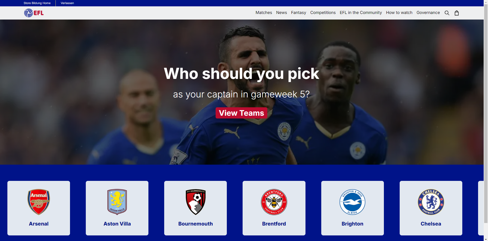

# EFL - English Football League Showcase (Lernprojekt)

## Haftungsausschluss

**Wichtiger Hinweis**: Diese Website ist ein reines Lernprojekt und hat keine offizielle Verbindung zur English Football League (EFL). Alle verwendeten Daten und Informationen stammen aus öffentlich zugänglichen Quellen. Ich besitze keinerlei Rechte an den EFL-Daten oder -Marken. Dieses Projekt dient ausschließlich Bildungszwecken und der Demonstration von Web-Entwicklungsfähigkeiten.

## Projektübersicht

EFL ist eine web-basierte Anwendung, entwickelt mit Next.js, die Daten über die English Football League von der thesportsdb.com API abruft und präsentiert. Die Benutzeroberfläche bietet einen interaktiven Slider-Karussell, implementiert mit Swiper, um Fußballdaten ansprechend darzustellen. Dieses Projekt wurde erstellt, um Next.js, API-Integration und moderne Frontend-Techniken zu erlernen und zu üben.

## Beispiel

Hier ist ein Beispiel, wie die EFL-Anwendung aussieht:



*Dieses Bild zeigt den Hauptbildschirm der EFL-Anwendung mit dem Swiper-Karussell, das verschiedene Teams der English Football League präsentiert.*

## Funktionen

- Abruf und Anzeige von Daten über die English Football League (zu Lernzwecken)
- Interaktiver Slider-Karussell zur Präsentation von Teams, Spielern oder Ligainformationen
- Responsive Design für optimale Darstellung auf verschiedenen Geräten

## Technologie-Stack

- [Next.js](https://nextjs.org/) - React Framework für serverseitiges Rendering und statische Websites
- [React](https://reactjs.org/) - JavaScript-Bibliothek für Benutzeroberflächen
- [Swiper](https://swiperjs.com/) - Moderner Mobile Touch Slider
- [thesportsdb.com API](https://www.thesportsdb.com/api.php) - Umfassende Sportdaten-API

## Installation

1. Klonen Sie das Repository:
   ```
   git clone https://github.com/makombengas/EFL---English-Football-League-
   ```

2. Wechseln Sie in das Projektverzeichnis:
   ```
   cd EFL---English-Football-League-
   ```

3. Installieren Sie die Abhängigkeiten:
   ```
   npm install
   ```

4. Erstellen Sie eine `.env.local` Datei im Wurzelverzeichnis und fügen Sie Ihren API-Schlüssel hinzu:
   ```
   NEXT_PUBLIC_SPORTSDB_API_KEY=IhrAPISchlüssel
   ```

## Verwendung

1. Starten Sie den Entwicklungsserver:
   ```
   npm run dev
   ```

2. Öffnen Sie Ihren Browser und navigieren Sie zu `http://localhost:3000`


## Swiper-Konfiguration

Der Slider-Karussell wurde mit Swiper implementiert. Die Hauptkonfiguration finden Sie in der Datei `components/TeamsBanner.js`.

## Beitragen

Da dies ein persönliches Lernprojekt ist, werden keine aktiven Beiträge gesucht. Jedoch sind Vorschläge und Feedback zur Verbesserung des Codes oder der Struktur willkommen.

## Lizenz

Dieses Projekt ist unter der MIT-Lizenz lizenziert, siehe `LICENSE` Datei für Details. Bitte beachten Sie, dass sich dies nur auf den Code bezieht, nicht auf die verwendeten Daten oder Marken der EFL.

## Kontakt

Bei Fragen oder Anregungen zum Lernprojekt können Sie ein Issue auf GitHub erstellen.

## Danksagung

Besonderer Dank gilt thesportsdb.com für die Bereitstellung der API, die dieses Lernprojekt ermöglicht hat, sowie der English Football League für die Inspiration.
